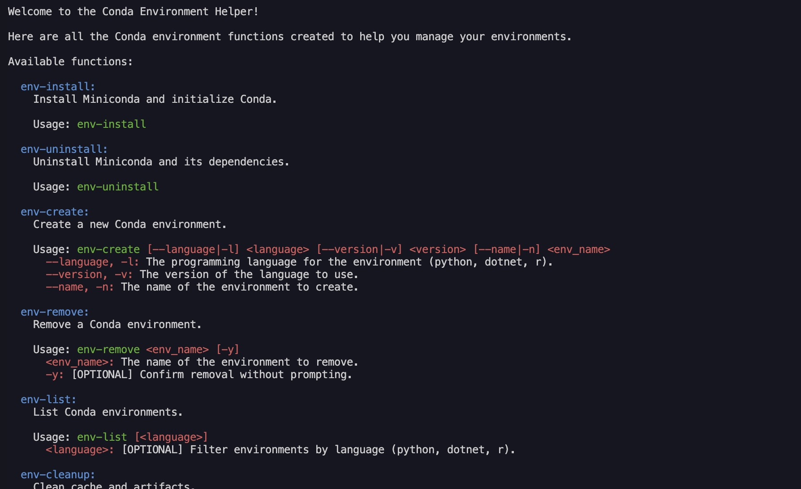

# Easy Env

> A set of bash commands to easily manage conda environments and miniconda.



## Getting Started

### Introduction

Easy Env is a small utility to simplify the management of conda environments and installation of miniconda. It is a set of bash commands that can be used to create, remove, and list conda environments. To learn more about what is conda, you can visit the [official website](https://docs.conda.io/en/latest/).

### Prerequisites

- terminal on bash or zsh

### Install

Get into your terminal in your home directory or where you want to install the project (somewhere stable).

To go to your home directory, use the following command:

```sh
cd ~
```

To install the project, download the .zip file from github or use the following command:

```sh
git clone https://github.com/MorganKryze/Easy-Env.git
```

Then, go to the project directory:

```sh
cd Easy-Env
```

You can add the commands to your shell configuration file (e.g. `~/.zshrc`). To do so, use the following command:

```sh
sh add-commands.sh
```

You may need to restart your terminal to use the commands below.

> [!NOTE]
> Do not hesitate to add a note if necessary.

> [!TIP]
> Do not hesitate to add a tip if necessary.

> [!WARNING]
> Do not hesitate to add a warning if necessary.

> [!IMPORTANT]
> Do not hesitate to add an important note if necessary.

> [!CAUTION]
> Do not hesitate to add a caution if necessary.

### Usage

Detail here the instructions to use the project.

### Troubleshooting

If you encounter this error message (or for any command):

```plaintext
zsh: command not found: env-help
```

You may not have add the path to the `easy-env.sh` file to your shell configuration file (e.g. `~/.zshrc`) or moved the project directory.

Then redo the following command and restart your terminal (or add manually the path to your .zshrc located in `~/.zshrc`):

```sh
sh add-commands.sh
```

### Project structure

Here are the most important files and directories of the project (you may ignore the other files and directories):

```plaintext
Easy-Env
├── src
│   ├── assets
│   │   └── img
│   │       └── screenshot.png
│   └── easy-env.sh
├── .gitignore
├── add-commands.sh
├── SECURITY
├── CODE_OF_CONDUCT
├── CONTRIBUTING
├── LICENCE
└── README.md
```

#### Small descriptives

##### `src/`

This directory contains the source code of the project.

##### `src/assets/`

This directory contains the assets of the project.

##### `easy-env.sh`

The main file of the project. It contains the commands of the project.

##### `add-commands.sh`

A file to add the commands to your shell configuration file (e.g. `~/.zshrc`).

## Supported platforms

(Tested on MacOS)

- zsh
- bash

## Supported languages

- .NET
- Python
- R

## Future improvements

- Compatibility with other shells
- Add more commands to manage conda environments
- Add more languages support

## Contributing

If you want to contribute to the project, you can follow the steps described in the [CONTRIBUTING](CONTRIBUTING) file.

## License

This project is licensed under the MIT License - see the [LICENSE.md](LICENSE) file for details.
